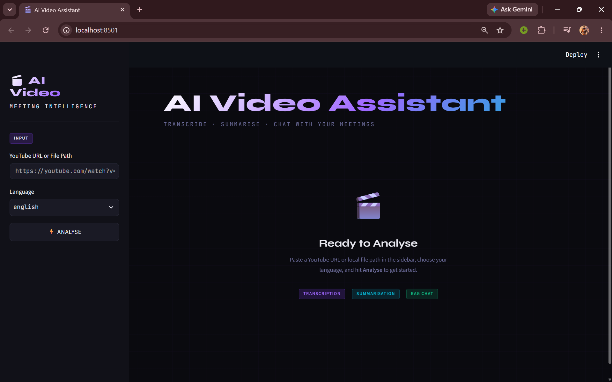
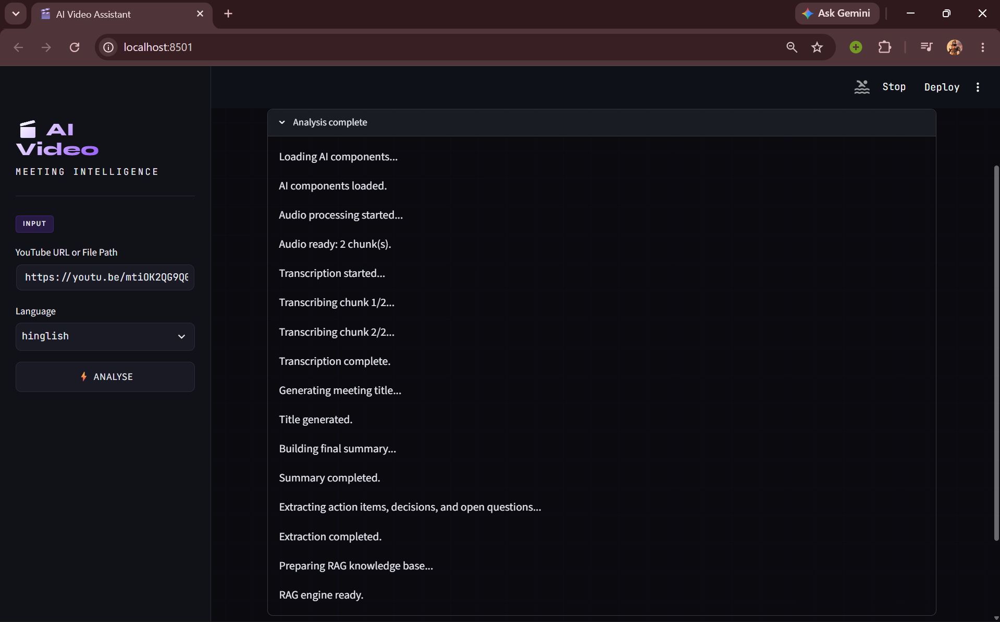
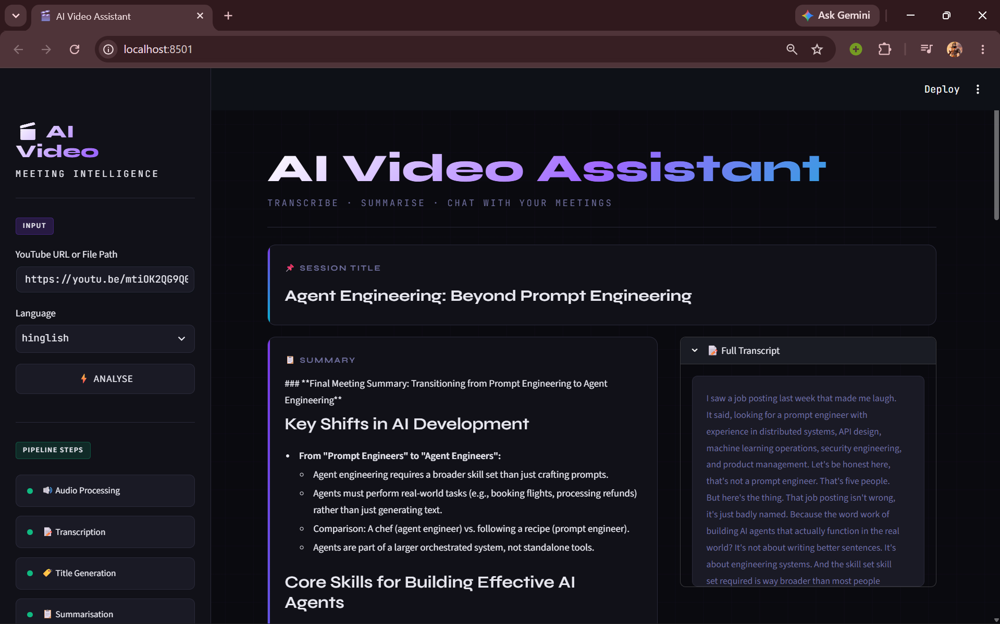
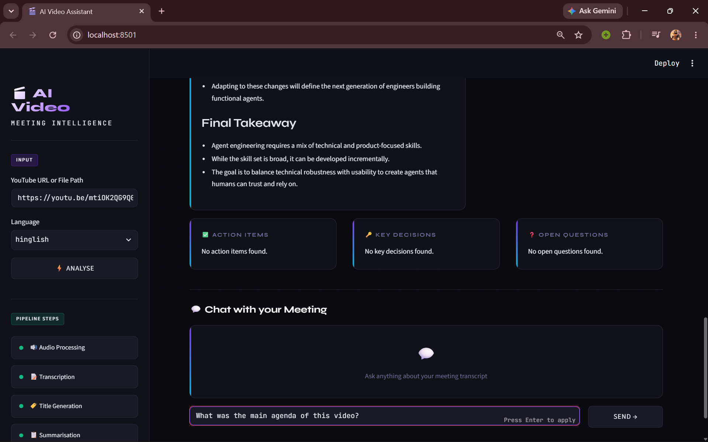

# 🎬 Meeting Intelligence

**AI Video Assistant** — Transcribe, summarize, and chat with your meetings and videos, straight from a YouTube link or a local file.

> Paste a YouTube URL (or local audio/video path), pick a language, hit **Analyse** — and get a full transcript, an AI-generated summary, action items, key decisions, open questions, and a chat interface to ask follow-up questions about the content.

---

## ✨ Features

- **🎯 Flexible Input** — Works with YouTube URLs or local file paths, no manual audio extraction needed.
- **🗣️ Multi-language Transcription** — Local [Whisper](https://github.com/openai/whisper) transcription with support for English, Hindi, and Hinglish (code-mixed Hindi-English).
- **🌐 Hindi → English Translation** — Automatically translates non-English speech so summaries and chat stay in English.
- **📝 AI Summarization** — Uses LangChain (LCEL) with the Mistral API to generate a session title, structured summary, action items, key decisions, and open questions.
- **💬 RAG-powered Chat** — Ask natural-language questions about the meeting and get grounded answers, powered by a ChromaDB vector store and HuggingFace sentence embeddings.
- **📄 Exportable Output** — Save transcripts and summaries as PDF or TXT for sharing and record-keeping.
- **⚡ Live Pipeline Status** — Real-time progress updates as audio is processed, transcribed, summarized, and indexed for chat.
- **🖥️ Clean Streamlit UI** — Simple sidebar input, live pipeline log, and a results dashboard with a dedicated chat panel.

---

## 📸 Demo

| Landing Page | Pipeline Running |
|---|---|
|  |  |

| Summary & Transcript | Chat with Meeting |
|---|---|
|  |  |

*(Add your own screenshots/GIFs to a `docs/` folder and update the paths above, or embed a short demo video/GIF here.)*

---

## 🏗️ How It Works

```
YouTube URL / File Path
        │
        ▼
 ┌─────────────────┐
 │ Audio Extraction │  yt-dlp / pytube + pydub
 └────────┬─────────┘
          ▼
 ┌─────────────────┐
 │  Transcription    │  OpenAI Whisper (local)
 └────────┬─────────┘
          ▼
 ┌─────────────────┐
 │  Translation      │  Hindi → English (deep-translator / googletrans)
 └────────┬─────────┘
          ▼
 ┌─────────────────┐
 │  Summarization    │  LangChain + Mistral API (title, summary, action items)
 └────────┬─────────┘
          ▼
 ┌─────────────────┐
 │  RAG Indexing     │  ChromaDB + HuggingFace embeddings
 └────────┬─────────┘
          ▼
 ┌─────────────────┐
 │  Chat & Export    │  Ask questions · Export PDF/TXT
 └─────────────────┘
```

---

## 🛠️ Tech Stack

| Layer | Technology |
|---|---|
| UI | Streamlit |
| Audio Acquisition | yt-dlp, pytube, pydub |
| Transcription | OpenAI Whisper (local), PyTorch/torchaudio |
| Translation | deep-translator, googletrans |
| LLM Orchestration | LangChain (LCEL), Mistral API |
| RAG / Vector Store | ChromaDB, langchain-chroma |
| Embeddings | sentence-transformers, langchain-huggingface |
| Export | ReportLab, fpdf2 |

---

## 🚀 Getting Started

### Prerequisites

- Python 3.10+ (project tested with 3.13/3.14)
- [FFmpeg](https://ffmpeg.org/download.html) installed and available on your `PATH` (required by Whisper and pydub)
- A [Mistral API key](https://console.mistral.ai/) (free tier available)

### 1. Clone the repository

```bash
git clone https://github.com/<your-username>/meeting-intelligence.git
cd meeting-intelligence
```

### 2. Create and activate a virtual environment

```bash
# Windows (PowerShell)
python -m venv .venv
.\.venv\Scripts\Activate.ps1

# macOS / Linux
python3 -m venv .venv
source .venv/bin/activate
```

### 3. Install dependencies

```bash
pip install -r Requirements.txt
```

### 4. Configure environment variables

Create a `.env` file in the project root:

```env
MISTRAL_API_KEY=your_mistral_api_key_here
```

### 5. Run the app

```bash
streamlit run app.py
```

The app will open at `http://localhost:8501`.

---

## 📖 Usage

1. Paste a **YouTube URL** or a **local file path** into the sidebar.
2. Choose the transcription **language** (English, Hindi, or Hinglish).
3. Click **Analyse** and watch the live pipeline log as audio is processed, transcribed, and summarized.
4. Review the generated **session title**, **summary**, **action items**, **key decisions**, and **open questions**.
5. Use the **Chat with your Meeting** panel to ask follow-up questions grounded in the transcript.
6. Export the results as PDF or TXT for sharing.

---

## 📁 Project Structure

```
VideoAgent/
├── app.py                 # Streamlit entry point / pipeline orchestration
├── main.py                # CLI / alternate entry point
├── core/
│   ├── extractor.py       # Audio extraction from YouTube/local files
│   ├── transcriber.py     # Whisper-based transcription
│   ├── summarizer.py      # LangChain + Mistral summarization
│   ├── rag_engine.py      # RAG chat over the transcript
│   └── vector_store.py    # ChromaDB vector store setup
├── utils/                 # Helper utilities
├── vector_db/             # Local vector store data
├── test.py                # Tests
├── Requirements.txt
└── .env                   # API keys (not committed)
```

---

## 🗺️ Roadmap

- [ ] Support additional languages beyond English/Hindi/Hinglish
- [ ] Speaker diarization (who said what)
- [ ] Cloud deployment guide (Streamlit Community Cloud / Docker)
- [ ] Support for more LLM providers

---


---

<p align="center">Built with ❤️ using Whisper, LangChain, and Streamlit</p>
